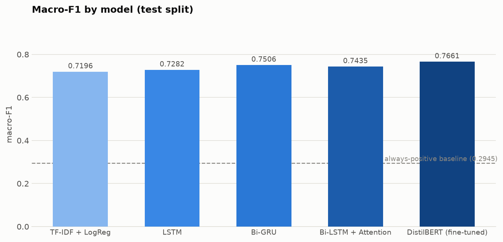
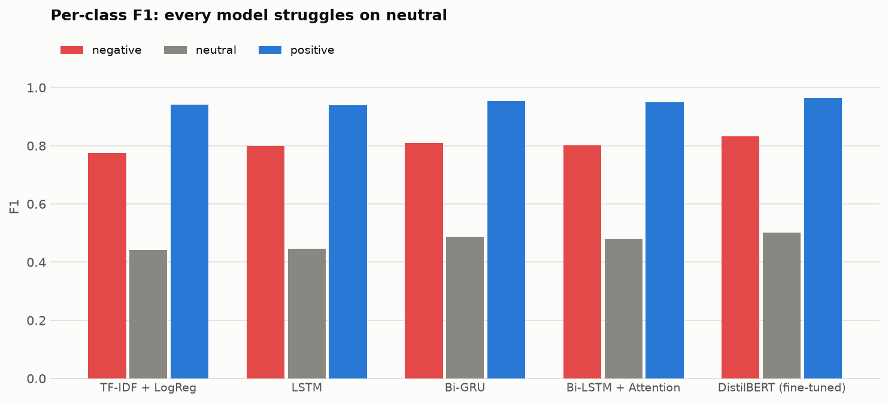
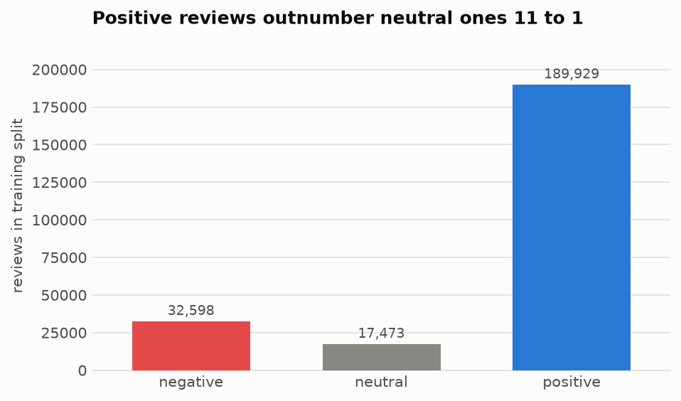
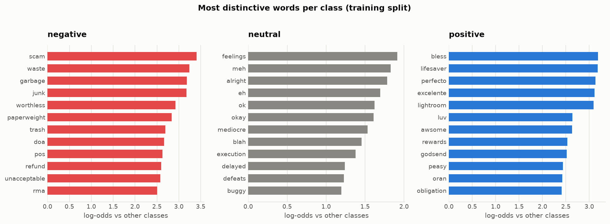
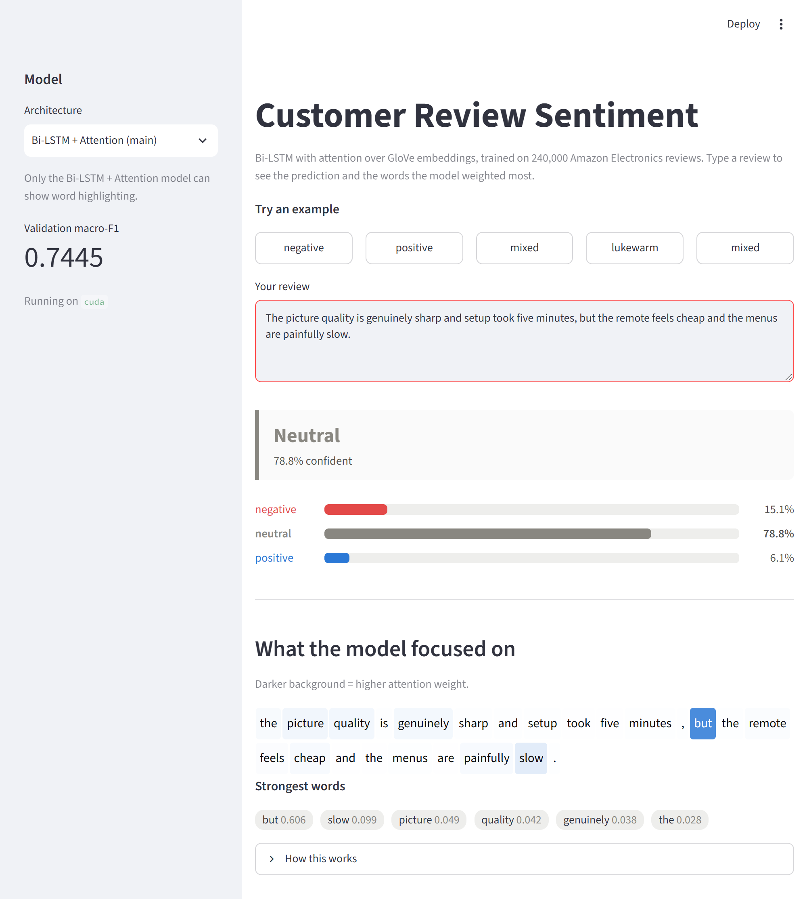
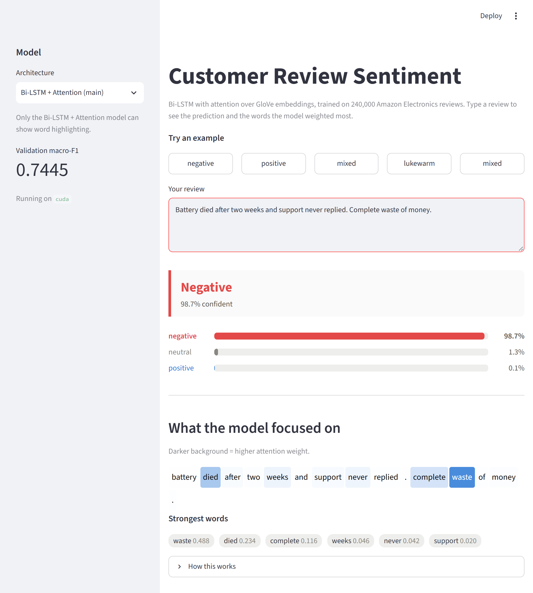
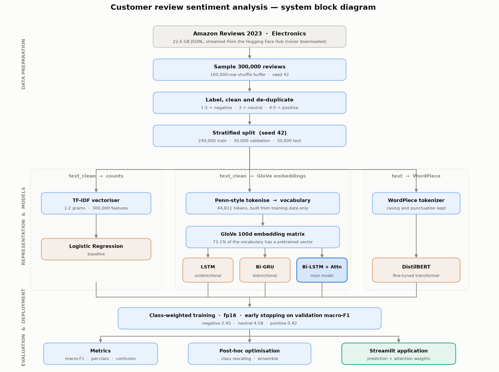

# Customer Review Sentiment Analysis Using LSTM for Online Shopping

Three-class sentiment classification (negative / neutral / positive) on 300,000
[Amazon Reviews 2023](https://huggingface.co/datasets/McAuley-Lab/Amazon-Reviews-2023)
Electronics reviews, comparing a classical baseline, three recurrent
architectures and a fine-tuned transformer **on identical data splits**.

The project's real subject is the **neutral class**. It is only 7.3% of the data,
it sits semantically between the other two, and every model here finds it hard.
Accuracy hides that completely - so macro-F1 is the headline metric throughout.

## Results

All five models are evaluated on the **same** 30,000-review test split, scored once.

| Model | Accuracy | **Macro-F1** | F1 negative | F1 neutral | F1 positive | Params |
|---|---|---|---|---|---|---|
| TF-IDF + LogReg *(baseline)* | 0.8697 | 0.7196 | 0.7753 | 0.4421 | 0.9412 | - |
| LSTM | 0.8688 | 0.7282 | 0.7996 | 0.4457 | 0.9394 | 4.6M |
| Bi-GRU | 0.8916 | 0.7506 | 0.8103 | 0.4874 | 0.9541 | 4.7M |
| Bi-LSTM + Attention *(main)* | 0.8834 | 0.7435 | 0.8016 | 0.4786 | 0.9504 | 4.8M |
| **DistilBERT (fine-tuned)** | 0.9086 | **0.7661** | 0.8327 | **0.5022** | 0.9634 | 67.0M |
| *always predict positive* | *0.7914* | *0.2945* | *0* | *0* | *0.8836* | *0* |




All five were trained on the full 240,000-row training split with the same
class-weighted loss and the same early-stopping rule, so this is an equal-footing
comparison. DistilBERT uses `max_len` 256 at batch 16; the recurrent models use
`max_len` 230 at batch 128.

### Optimised results

Every model except the fully fine-tuned DistilBERT over-predicts neutral - test
recall exceeds precision by 0.22 to 0.29 on that class. That is the
class-weighted loss doing its job too enthusiastically, with `argmax` then taking
the inflated scores at face value. F1 peaks when precision and recall are
balanced, so rescaling the predicted probabilities per class recovers macro-F1
without retraining.

The scaling vector is searched on the **validation split only**, then applied
once to test (`python -m src.optimize`).

| Model | Macro-F1 | + tuned | Δ | Neutral F1 | + tuned |
|---|---|---|---|---|---|
| TF-IDF + LogReg | 0.7196 | 0.7289 | +0.0094 | 0.4421 | 0.4465 |
| LSTM | 0.7282 | 0.7396 | +0.0113 | 0.4457 | 0.4651 |
| Bi-GRU | 0.7506 | 0.7510 | +0.0004 | 0.4874 | 0.4916 |
| Bi-LSTM + Attention | 0.7435 | 0.7507 | +0.0072 | 0.4786 | 0.4850 |
| DistilBERT | 0.7662 | 0.7662 | +0.0000 | 0.5025 | 0.5025 |
| Ensemble (mean of 5) | 0.7643 | 0.7692 | +0.0049 | 0.5076 | 0.5206 |
| **Ensemble (greedy weights)** | 0.7757 | **0.7759** | +0.0003 | 0.5251 | **0.5269** |

**Best result: 0.7759 macro-F1 with neutral F1 0.5269** - up from 0.7196 for the
baseline, a gain of +0.056 overall.

The tuned vectors always *raise* positive and *lower* neutral, which is the
over-prediction diagnosis confirmed numerically. The one model that gains nothing
is DistilBERT, whose fitted weights come out at exactly `[1.00, 1.00, 1.00]`: the
same architecture trained on a quarter of the data had needed a correction worth
+0.0083, so training to convergence on the full split is what produced a
calibrated classifier.

### Experiments that did not work

Reported because a failed experiment is still evidence, and omitting them would
misrepresent how the final configuration was reached.

| Experiment | Baseline | Result | Δ |
|---|---|---|---|
| Bi-GRU, 2 layers / hidden 192 / max_len 320 | 0.7506 | 0.7510 | +0.0004 |
| Bi-GRU, ordinal loss (smoothing 0.15) | 0.7506 | 0.7401 | −0.0105 |
| Bi-LSTM + Attention, ordinal loss | 0.7435 | 0.7390 | −0.0045 |

The capacity experiment raised *validation* macro-F1 to 0.7558 but moved test by
0.0004 — 800k extra parameters fitted the validation split, not the task. The
ordinal loss (distance-aware soft targets, so confusing the two poles costs more
than confusing adjacent classes) is well motivated for an ordinal label, but it
works against the class weighting, which is deliberately trying to sharpen the
model's willingness to commit to the rare neutral class.

### What the numbers actually say

1. **The transformer wins, but not by much for its size.** DistilBERT leads at
   0.7661 with 67M parameters against the Bi-GRU's 0.7506 with 4.7M — a gain of
   0.0155 for roughly 14× the parameters.
2. **Bidirectionality matters more than attention here.** LSTM 0.7282 → Bi-GRU
   0.7506 is a bigger jump than anything attention added, and covers more than
   half the distance from the plain LSTM to the transformer.
3. **The Bi-GRU beats the nominated main model** (0.7506 vs 0.7435). Reported as
   measured; a capacity experiment suggests the gap is within run-to-run variation.
4. **Every learned model beats bag-of-words, by less than you'd expect.** The
   plain LSTM buys +0.009 macro-F1 over TF-IDF for 4.6M parameters, because word
   presence alone already carries most of the sentiment signal.
5. **No model reached 0.53 neutral F1.** Across five very different families,
   including a pretrained transformer, that consistency is the strongest evidence
   the limit is in the labels rather than the models — see
   [the error analysis](results/error_analysis.md).
6. **Calibration beat capacity.** Rescaling and ensembling added +0.010 over the
   best single model, while doubling the depth and width of the best recurrent
   architecture added nothing.

## Why accuracy is the wrong metric

79.14% of these reviews are positive. A model that ignores its input and answers
"positive" every time scores:

| Metric | Always-positive |
|---|---|
| Accuracy | **0.7914** |
| Macro-F1 | **0.2945** |

An 0.79 accuracy sounds respectable and is worthless. Macro-F1 averages the three
classes equally, so the 7% neutral class counts as much as the 79% positive one,
and a model cannot hide behind the majority.

## Labels and data

| Stars | Class | Code | Share of data |
|---|---|---|---|
| 1-2 | negative | 0 | 13.58% |
| 3 | neutral | 1 | 7.28% |
| 4-5 | positive | 2 | 79.14% |



Full exploratory analysis: [`notebooks/01_eda.ipynb`](notebooks/01_eda.ipynb).
Two findings from it shaped everything downstream:



Negative reviews have strongly distinctive vocabulary (log-odds up to 3.4:
*scam*, *garbage*, *worthless*) and so do positive ones (3.2: *lifesaver*,
*godsend*). **Neutral peaks at only 1.9** - its markers are hedges like *meh*,
*eh*, *alright*, *mediocre*. Neutral has no vocabulary of its own; it is
expressed through contrast. That predicted, before any model was trained, both
that neutral would be the hardest class and that an attention layer might help by
finding the pivot word.

## Setup

```bash
git clone <this-repo>
cd amazon-sentiment-lstm

python -m venv venv
venv\Scripts\activate                 # Windows;  source venv/bin/activate on Linux/macOS

pip install -r requirements.txt
```

PyTorch is installed separately, because the CUDA build does not come from PyPI
(installing it via `requirements.txt` would quietly give you the CPU-only wheel):

```bash
pip install torch --index-url https://download.pytorch.org/whl/cu124 --resume-retries 10
```

The wheel is ~2.5 GB. If the download keeps dropping, fetch it with a download
manager and install from the file instead:

```
https://download.pytorch.org/whl/cu124/torch-2.6.0%2Bcu124-cp312-cp312-win_amd64.whl
```

```bash
pip install "C:\path\to\torch-2.6.0+cu124-cp312-cp312-win_amd64.whl"
python -c "import torch; print(torch.__version__, torch.cuda.is_available())"
```

Only `torch` is needed - `torchvision` and `torchaudio` are unused.

> **Windows Smart App Control.** If an import fails with
> `ImportError: DLL load failed ... An Application Control policy has blocked this file`,
> Windows is refusing to load compiled extensions that lack an established
> reputation. The pinned versions in `requirements.txt` are chosen to avoid this.
> Do not "fix" it by disabling Smart App Control - that is a one-way switch that
> can only be re-enabled by resetting Windows.

## Reproducing the results

Run in order. Every step is seeded with 42.

```bash
python -m src.data                                  # 1. stream + split the dataset  (~10 min)
jupyter nbconvert --execute notebooks/01_eda.ipynb  # 2. exploratory analysis
python -m src.baseline                              # 3. TF-IDF + Logistic Regression (~4 min)
python -m src.download_glove                        # 4. GloVe vectors (822 MB, resumable)
python -m src.train --model bilstm_attention        #    main model                   (~12 min)
python -m src.train --model lstm                    # 5. other architectures
python -m src.train --model bigru
python -m src.train_distilbert --train-subset 60000 #    transformer upper bound
python -m src.compare                               #    comparison table + charts
python -m src.error_analysis                        # 6. confusion matrix + attention
```

Timings are for an RTX 4050 Laptop (6 GB) with mixed precision.

## Interactive demo

Type your own review and get a live prediction with class probabilities and the
words the attention layer weighted:

```bash
python -m src.predict            # terminal
streamlit run app/app.py         # browser UI
```



The screenshot above is the most informative case in the whole project. Given
*"The picture quality is genuinely sharp and setup took five minutes, **but** the
remote feels cheap and the menus are painfully slow"*, the model answers
**neutral (78.8%)** - and the word it weights most heavily is **`but` at 0.606**,
six times the next token.

Nothing told the model that "but" matters. It has no sentiment of its own, and a
bag-of-words model can only treat it as a common stopword. The attention layer
learned that it is the *pivot* where a review turns, which is exactly the
mechanism the EDA predicted would be needed for the neutral class.



```
review > the screen is gorgeous but the battery barely lasts a day

  NEUTRAL (61.2% confident)

    negative  ########....................  14.9%
    neutral   #################...........  61.2%
    positive  #######.....................  23.9%

    words the model focused on:
      but (0.29)  barely (0.18)  gorgeous (0.11)  battery (0.08)
```

Both paths reuse `normalise_text`, `clean_for_neural` and `tokenize` from the
training code. If inference cleaned text even slightly differently from training,
the model would silently lose accuracy with no error message.

## How it works




```
raw review text
   |
   |-- normalise_text()    HTML unescaped, tags and URLs stripped, whitespace collapsed
   |                       -> kept for DistilBERT (its tokenizer wants natural text)
   |
   |-- clean_for_neural()  lowercased, repeated characters collapsed
   |-- tokenize()          Penn-style: punctuation split off, contractions split
   |                       -> used by TF-IDF and the recurrent models
   v
 token ids -> GloVe embeddings (100d) -> Bi-LSTM -> attention -> 3 class probabilities
```

### The main model

A bidirectional LSTM reads the review in both directions, then an **additive
attention layer** scores every token and produces a weighted summary, instead of
relying only on the final hidden state.

Two reasons that matters:

1. **Accuracy.** The final hidden state forces a whole review through one vector
   at the last timestep, so evidence early in a long review has to survive to the
   end. Attention can look back at any position.
2. **Interpretability.** The attention weights are readable, which is what powers
   the word highlighting in the demo and the heatmaps in the error analysis.

Padding is masked to `-inf` *before* the softmax. Masking afterwards would be a
subtle bug: padded positions would already have taken probability mass from real
tokens.

## Project structure

```
src/
  data.py             stream, label, clean and split the dataset
  vocab.py            vocabulary + GloVe embedding matrix + tokenizer
  models.py           LSTM, Bi-GRU, Bi-LSTM+attention
  train.py            shared training loop (class weights, early stopping, fp16)
  train_distilbert.py transformer fine-tuning
  baseline.py         TF-IDF + Logistic Regression
  metrics.py          one definition of every reported number
  compare.py          comparison table and charts
  error_analysis.py   confusion matrix, failure cases, attention heatmaps
  predict.py          interactive inference (CLI + shared by the app)
  viz.py              shared plot style and palette
  download_glove.py   fetch pretrained vectors
notebooks/01_eda.ipynb
app/app.py            Streamlit demo
results/              metrics, comparison tables, figures  (tracked)
data/                 dataset and embeddings               (gitignored)
models/               trained checkpoints                  (gitignored)
```

## Methodology notes

These are the decisions that make the numbers trustworthy:

- **The test split is scored once**, after every hyperparameter choice is locked
  in on validation. The baseline's `C` and every model's stopping epoch are
  selected on validation only.
- **Splits are stratified** and identical for all five models: 240,000 / 30,000 /
  30,000 with the class ratio held to 13.58 / 7.28 / 79.14 in each.
- **Duplicates are removed before splitting.** 13,887 duplicate reviews appeared
  while collecting 300k rows; had they been split across train and test, every
  score would be inflated.
- **EDA uses the training split only.** Plotting validation or test data would
  leak into choices made from those plots (vocabulary size, `max_len`, weights).
- **The vocabulary is built from training text only**, for the same reason.
- **Class-weighted loss** everywhere (negative 2.45, neutral 4.58, positive 0.42).

### A bug worth documenting

The first Bi-LSTM run scored 0.7218 macro-F1 - statistically tied with a
bag-of-words baseline, which was suspicious for a 4.7M-parameter model with
pretrained embeddings. GloVe coverage turned out to be only **45.6%**, and 87.2%
of the misses were punctuation glued to words: splitting on whitespace produced
`great.`, `good.` and `don't` as single tokens, none of which exist in GloVe, so
the most sentiment-bearing words were being mapped to `<unk>` and given random
vectors.

GloVe was trained on Penn-tokenised text. Matching that tokenisation raised
coverage to **73.1%** and the main model to **0.7435** - a gain of +0.022 macro-F1
from a change that touched no architecture at all.

## Dataset

`McAuley-Lab/Amazon-Reviews-2023`, Electronics category. The raw file is 22.6 GB,
so `src/data.py` streams it from the Hub and samples 300,000 rows through a
seeded 100,000-row shuffle buffer rather than downloading it or taking the top of
the file. The sample is cached locally, so only the first run pays the cost.

## What I'd do next

In order of expected return, from the [error analysis](results/error_analysis.md):

1. **Ordinal loss.** Confusing neutral with positive is a smaller mistake than
   confusing negative with positive, but cross-entropy treats them identically.
   An ordinal formulation targets the exact cell that produces 46% of all errors.
2. **Tune the decision threshold on validation** instead of taking `argmax`.
   Neutral sits at precision 0.376 / recall 0.659 - a lopsided operating point
   that the class weight chose bluntly.
3. **Give DistilBERT a fair run** - full 240k training set at `max_len` 230 - to
   find out what the real transformer ceiling is here.
4. **Accept the label ceiling.** Roughly half the confident neutral errors have
   text that contradicts the star rating. That is fixed with better labels, not a
   better architecture.

## License

Released for educational and portfolio use. The dataset is subject to its own
terms - see the [dataset card](https://huggingface.co/datasets/McAuley-Lab/Amazon-Reviews-2023).
