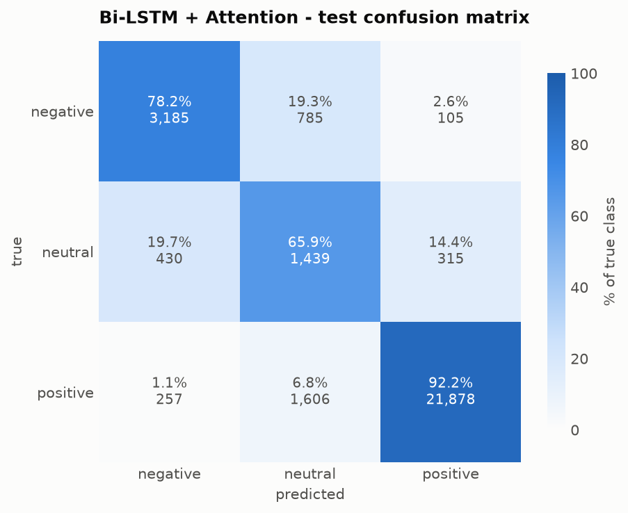
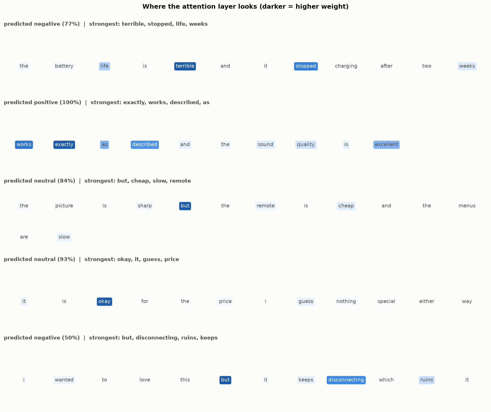

# Error analysis - Bi-LSTM + Attention

Test split, 30,000 reviews. Test macro-F1 **0.7435**, accuracy **0.8834**.

## 1. Confusion matrix

| true \ predicted | negative | neutral | positive | recall |
|---|---|---|---|---|
| **negative** (4,075) | 3,185 | 785 | 105 | 0.782 |
| **neutral** (2,184) | 430 | 1,439 | 315 | 0.659 |
| **positive** (23,741) | 257 | 1,606 | 21,878 | 0.922 |

| class | precision | recall | F1 |
|---|---|---|---|
| negative | 0.823 | 0.782 | 0.802 |
| neutral | **0.376** | 0.659 | **0.479** |
| positive | 0.981 | 0.922 | 0.950 |

**The single dominant error is 1,606 positive reviews predicted neutral.** That one
cell accounts for 46% of all errors and is what holds neutral precision down to
0.376: of the 3,830 reviews the model calls neutral, only 1,439 actually are.

This is a direct, predictable consequence of the class weighting. Neutral carries
a loss weight of 4.58 against positive's 0.42 - roughly 11:1 - so the model is
explicitly told that missing a neutral is far more costly than a false alarm. It
responds by over-claiming neutral. That trade is deliberate: without weighting,
macro-F1 collapses because neutral recall goes to near zero.

Note also that the model almost never confuses the two poles: only 105 negatives
predicted positive and 257 positives predicted negative, out of 27,816. The
sentiment axis itself is learned well. **Essentially all remaining difficulty is
the neutral boundary.**

## 2. Twenty misclassified neutral reviews

Sorted by how confidently the model was wrong, which is where reasoning breaks
down hardest. Full data in [`misclassified_neutrals.json`](misclassified_neutrals.json).

All twenty were predicted **positive**. Reading them, they fall into four groups -
and the largest group is not a model failure at all.

### Group A - the star rating contradicts the text (11 of 20)

The review text is unambiguously positive; only the 3-star rating says neutral.

| # | Conf. | Review |
|---|---|---|
| 10 | 99.4% | "I love it. I love it" |
| 9 | 99.5% | "Great item as advertised. Great item as advertised" |
| 3 | 99.8% | "Happy with my purchase. Super cute and comfortable" |
| 7 | 99.7% | "Works great Gift !!. Was a Gift !!!" |
| 8 | 99.6% | "Works well for the money. I am easily pleased. It works. I'm happy." |
| 19 | 98.6% | "Worth the cost.. Great speeds." |
| 18 | 98.7% | "Working well so far. These headphones are work well so far I have no issues." |
| 4 | 99.7% | "great quality for the cost!!. anything u need for a beginner" |
| 15 | 98.9% | "Best price and prime. As expected" |
| 5 | 99.7% | "The Best Bluetooth. ... Sound quality is good ... always able to hear the callers" |
| 12 | 99.1% | "Fast claims. Fast claims" |

**There is no text signal that could recover the correct label here.** "I love it.
I love it" is positive by any reading; the reviewer simply chose 3 stars. This is
label noise arising from the project's core assumption - that a star rating is a
proxy for sentiment. Reviewers use the scale inconsistently: some treat 3 as
"satisfied, not blown away", others as a genuine middle.

A human annotator given only the text would make the same mistakes. This portion
of the neutral error is a **ceiling imposed by the labels**, not a modelling
deficiency, and it is the main reason neutral F1 sits near 0.48 rather than 0.8.

### Group B - genuinely mixed, but praise dominates the wording (6 of 20)

| # | Review | The buried caveat |
|---|---|---|
| 2 | "Four Stars. Great case, would've made 5 stars if it had better cablemangament room, and better airflow" | conditional, phrased as praise |
| 6 | "Works great with the N64 ... color is whitewashed on the wii" | last clause only |
| 11 | "Nice multi card reader at a good price. It seems a little flimsy though" | final "though" |
| 14 | "Good price. Love it. Great product. Doesn't have all the bells and whistles fitbit does." | 3 positives, 1 negative |
| 20 | "These were great starter headphones, but they'll leave you wanting better quality." | "but" clause |
| 17 | "...pleasantly surprised ... the sound quality isn't as high tech as we have now, but ... nevertheless." | hedged, garbled text |

These are real errors and genuinely recoverable. The pattern: the critical
information sits in **one short clause at the end**, outweighed by two or three
positive statements before it. Review #2 is the clearest - the reviewer's own
title says "Four Stars", and the complaint is phrased as a compliment ("would've
made 5 stars if").

The attention layer does find contrast words (see section 3), but attention is a
*weighted average*. Three strong positive tokens can still outvote one "though",
because averaging cannot express "this one clause negates everything before it".

### Group C - long reviews where the caveat is diluted or truncated (2 of 20)

Reviews #13 and #16 run past the 230-token limit, and both spend most of their
length on positives before qualifying. #13 even contains a later "Update -" that
is cut off entirely. Length is a real failure mode: with `max_len = 230`, roughly
6% of reviews lose their ending, and for reviews structured as
*praise → qualification* the truncated part is the part that mattered.

### Group D - sarcasm / figurative praise (1 of 20)

Review #1 - "much bigger than I had imagined, (could house a family of hobbits)" -
is a size complaint dressed as enthusiasm. Every surface cue is positive.
Sarcasm is out of reach for this architecture.

### What this means

Roughly **11 of 20 of the most confident neutral errors are unrecoverable from
text alone.** Improving the model would address Groups B and C, perhaps 8 of 20.
The honest conclusion is that the remaining gap on neutral is mostly a property
of star ratings as labels, and reporting it as a modelling failure would
misrepresent the problem.

## 3. Attention heatmaps

Attention weights over five reviews, normalised per review (attention is a
distribution over one sequence, so values are not comparable across reviews).

The EDA predicted that neutral is signalled by *contrast* rather than by its own
vocabulary. The attention maps confirm that directly:

| Review | Prediction | Highest-weighted tokens |
|---|---|---|
| "the battery life is terrible and it stopped charging after two weeks" | negative (77%) | **terrible**, stopped, life |
| "works exactly as described and the sound quality is excellent" | positive (100%) | **exactly**, works, described |
| "the picture is sharp **but** the remote is cheap and the menus are slow" | neutral (84%) | **but**, cheap, slow |
| "it is okay for the price i guess nothing special either way" | neutral (93%) | **okay**, it, guess |
| "i wanted to love this **but** it keeps disconnecting which ruins it" | negative (50%) | **but**, disconnecting, ruins |

Three observations:

1. **"but" is the single highest-weighted token in both mixed reviews.** The model
   learned, without being told, that the contrastive conjunction is where
   sentiment turns - exactly the hypothesis from the EDA. A bag-of-words model
   cannot represent this, because "but" carries no sentiment on its own; it only
   matters as a *pivot* between two clauses.
2. **Sentiment-bearing content words dominate the clear cases** - "terrible" for
   negative, "exactly"/"works" for positive - rather than function words. The
   attention is not degenerate.
3. **The last review is correctly uncertain**: 50% negative. "i wanted to love
   this but it keeps disconnecting" genuinely sits between neutral and negative,
   and the model's low confidence reflects that rather than guessing boldly.

This is the practical argument for the attention layer beyond accuracy: the
weights are a readable explanation, which is what the Streamlit demo surfaces to
a user.

## 4. What would actually improve this

In rough order of expected return:

1. **Treat the star rating as ordinal, not categorical.** Confusing neutral with
   positive is a smaller error than confusing negative with positive, but
   cross-entropy treats them identically. An ordinal loss would target the exact
   cell that dominates the error.
2. **Raise `max_len` or use a last-N-tokens window.** Reviews structured as
   praise-then-caveat lose the caveat to truncation (Group C).
3. **Tune the decision threshold on validation**, rather than taking `argmax`.
   Neutral precision 0.376 against recall 0.659 is a lopsided operating point;
   the class weight is a blunt instrument for choosing it.
4. **Accept the label ceiling.** Group A cannot be fixed by modelling. If neutral
   performance genuinely mattered for an application, the fix is better labels -
   human annotation of sentiment from text - not a better architecture.
